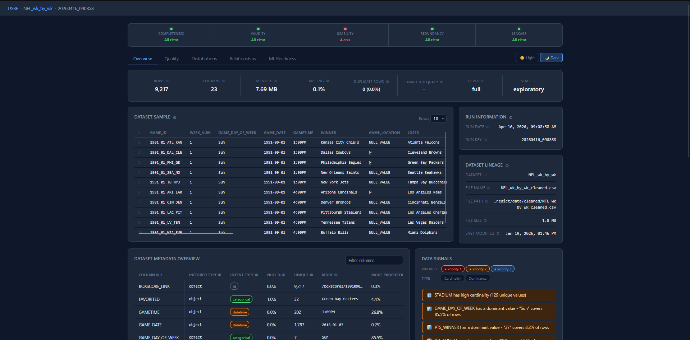

# DSBF — Data Scientist's Best Friend

[](https://www.python.org/)
[](LICENSE)
[](https://github.com/astral-sh/ruff)
[](https://github.com/facebook/pyrefly)

**DSBF is a statistically grounded, workflow-aware profiling engine designed to be a reliable co-pilot at every phase of the data science process.**

The goal is simple: the exploratory and preparatory portions of data science work are largely reproducible. The same questions get asked of every new dataset — what's missing, what's skewed, what's redundant, what's suspicious — and they deserve a standardized, rigorous answer every time. DSBF provides that answer through a structured task engine, a five-dimension quality framework, and an interactive dashboard that turns raw data into actionable insight within minutes.

The first phase — **Exploratory Data Analysis** — is what DSBF does today. It gives any data scientist, regardless of experience level, an immediately reproducible structure for understanding a new dataset: consistent findings, plain-English guidance grounded in statistical theory, and a dashboard designed to accelerate insight rather than replace judgment. From there, a dataset can be understood on its own terms before any modeling assumptions are introduced.

The broader vision is a tool that grows with the workflow — covering data preparation, modeling, inference, and tradeoff analysis under the same statistically honest, reproducible framework. That work is ongoing.

---

## Standing on the shoulders of giants

Tools like [ydata-profiling](https://github.com/ydataai/ydata-profiling) and [Great Expectations](https://github.com/great-expectations/great-expectations) are genuinely excellent and were a direct inspiration for this project. ydata-profiling in particular demonstrated how much value a single well-designed profiling report could deliver to a data scientist's workflow.

DSBF takes a different set of design bets:

**On scoring:** most tools surface an aggregate quality score. DSBF deliberately does not — a single number creates false anchoring and masks the specific dimensions that actually matter. Five independently-scored dimensions (Completeness, Validity, Usability, Redundancy, Leakage) replace it, each with its own traffic-light indicator and findings.

**On language:** DSBF treats epistemic honesty as a design constraint. Where the evidence is ambiguous — missingness mechanism classification is a good example — DSBF uses hedged language ("consistent with MAR") and caps confidence deliberately. It will never claim to confirm what the data can only suggest.

**On workflow scope:** rather than producing a static report, DSBF is designed as a growing co-pilot. The EDA phase is what exists today. Modeling preparation, modeling, inference, and tradeoff analysis are the phases being built toward — all under the same statistically rigorous, reproducible framework.

---

## Dashboard



The Vue 3 SPA dashboard gives you:

- **Overview tab** — five traffic-light quality indicators (Completeness, Validity, Usability, Redundancy, Leakage) with a trust banner that updates as you profile
- **Distributions tab** — per-column analysis with outlier detection, normality assessment, skewness findings, and transformation previews
- **Relationships tab** — pairwise association table (Pearson r, Cramér's V, eta-squared, Kendall's τ), correlation heatmap, and fuzzy duplicate detection
- **Quality tab** — dimension-by-dimension findings with severity-ranked rows, expandable detail, and inline remediation guidance
- **ML Readiness tab** — five preparation-action dimensions (Transformations Needed, Encoding Required, Missingness Impact, Leakage Risk, Unusable Features) with a gate banner
- **Time Series tab** — ACF/PACF, stationarity tests, and seasonal decomposition

---

## Architecture

```
CSV / DataFrame
      │
      ▼
┌─────────────────────────────────────────────────────┐
│  Task Engine  (DAG-based, dependency-aware)         │
│  60+ tasks · topological execution · failure        │
│  recovery · profiling depth · stage inference       │
└────────────────────┬────────────────────────────────┘
                     │  TaskResult objects
                     ▼
              SQLite + JSON store
                     │
                     ▼
            FastAPI REST backend
                     │
                     ▼
            Vue 3 SPA dashboard
```

Every task is a self-contained Python class that declares its dependencies, expected semantic types, and runtime estimate. The DAG engine resolves execution order, handles failures without stopping the run, and writes structured `TaskResult` objects to a SQLite store. The FastAPI backend serves those results to the Vue dashboard over a clean REST API.

---

## Key design principles

**No single aggregate scores.** Both a numeric DQ score and column-level ML Readiness scores were designed and then scrapped — single numbers create false anchoring and ambiguous meaning across domains. Five independently-scored dimensions replaced them.

**Epistemic honesty as a first-class constraint.** Missingness mechanism analysis (MCAR / MAR / MNAR classification) deliberately caps confidence at "moderate" and uses `consistent_with` language throughout. DSBF will never claim to *confirm* MNAR — only to report evidence consistent with it.

**Severity-aware traffic lights.** A four-state system (🟢 green / 🔵 blue / 🟡 amber / 🔴 red) maps both *severity* and *proportion* to color. A single `warn`-level finding on a 500-column dataset is always amber — it never hides behind a green dot just because it affects 0.2% of columns.

**Semantic type filtering.** Tasks that operate on continuous columns filter by `analysis_intent_dtype`, not `pandas dtype`. A boolean stored as `int64` will not enter VIF computation or outlier detection.

---

## Installation

```bash
git clone https://github.com/W-Thurston/dsbf.git
cd dsbf
poetry install
```

**Requirements:** Python 3.10+ · Optional: Graphviz (DAG visualizations)

---

## Quickstart

### CLI — profile a CSV

```bash
poetry run dsbf profile data.csv
poetry run dsbf profile data.csv --depth full --verbosity debug
```

### CLI — built-in datasets

```bash
poetry run dsbf quickstart titanic     # seaborn built-in
poetry run dsbf quickstart iris        # sklearn built-in
```

### Python API

```python
from dsbf.api import profile_file

results = profile_file("data.csv", depth="standard")
```

### In-memory DataFrame

```python
from dsbf.api import ProfileEngine
import pandas as pd

engine = ProfileEngine()
engine.df = pd.read_csv("data.csv")
results = engine.run()
```

### Launch the dashboard

```bash
# Start the FastAPI backend
poetry run uvicorn dsbf.api.main:app --reload

# In a separate terminal, start the Vue dev server
cd dsbf/dashboard/frontend && npm install && npm run dev
```

---

## Profiling depth

| Depth | Tasks | Best for |
|---|---|---|
| `basic` | Core shape, nulls, types | Quick triage, large datasets |
| `standard` | + distributions, outliers, associations | Typical EDA workflow |
| `full` | + ML readiness, time series, fuzzy duplicates | Pre-modeling audit |

---

## Output artifacts

Each run writes to a timestamped directory under `dsbf/outputs/`:

| File | Description |
|---|---|
| `report.json` | All task results — findings, guidance, reliability warnings |
| `metadata_report.json` | Timing, system info, task diagnostics |
| `run.log` | Full execution log |
| `figs/` | Static plots (PNG) and interactive SVG |
| `dag.png` | Task execution graph (if enabled) |

---

## Configuration

```yaml
# default_config.yaml — key options
metadata:
  profiling_depth: "standard"   # basic | standard | full
  message_verbosity: "info"     # quiet | warn | stage | info | debug

engine:
  backend: "polars"             # polars | pandas

tasks:
  detect_outliers:
    sensitivity: 0.01
  detect_collinear_features:
    vif_threshold: 10.0

time_series:
  enabled: false
  index_column: null            # must be set explicitly — DSBF will not guess
```

---

## Extending DSBF

Tasks are registered with a decorator and discovered automatically:

```python
from dsbf.core.base_task import BaseTask
from dsbf.eda.task_registry import register_task

@register_task(
    display_name="My Custom Task",
    depends_on=["infer_types"],
    profiling_depth="standard",
    expected_semantic_types=["continuous"],
)
class MyCustomTask(BaseTask):
    def run(self) -> None:
        df = self.input_data
        matched_cols, _ = self.get_columns_by_intent()
        # ... your logic here
        self.output = TaskResult(name=self.name, status="success", ...)
```

Load custom task directories via config:

```yaml
task_groups:
  - core
  - ./custom_plugins/my_domain/
```

---

## Validation suite

DSBF ships with a purpose-built validation suite covering eight dataset archetypes:

| Dataset | Purpose |
|---|---|
| `clean` | Baseline — all tasks succeed, no false positives |
| `tiny` | 25-row graceful degradation, low-N reliability warnings |
| `near_clean` | Calibration — mild issues detected correctly |
| `all_categorical` | Zero continuous columns — continuous tasks degrade cleanly |
| `high_missingness` | Structured MAR patterns, extreme null rates |
| `severe_multicollinearity` | Four VIF failure modes including scale-mismatch regression test |
| `single_column` | Pair-based tasks degrade gracefully with one column |
| `wide` | 100-column scale — column browser, heatmap, pairwise associations |

```bash
# Run the full validation suite
poetry run python tests/validation/run_validation.py

# Run a single dataset
poetry run python tests/validation/run_validation.py --datasets near_clean --skip-generate
```

---

## Roadmap

**Near-term — designed, partially built:**
- [ ] Time Series tab — complete ACF/PACF, stationarity, and decomposition views with friendly empty state when no datetime index is configured
- [ ] Visualization refactor — D3-native chart components replacing the current static SVG approach; richer interactivity in the Distributions and Relationships tabs
- [ ] Findings tab — cross-column finding explorer with column-level deep-dive linking

**Medium-term — direction clear, scope open:**
- [ ] Domain packs — pre-configured task sets and thresholds for specific domains (healthcare, financial, NLP)
- [ ] Dataset comparison — profile two datasets side-by-side to detect drift, schema changes, or distribution shift across time windows
- [ ] Pipeline hooks — lightweight integrations for dbt, Airflow, and Prefect to run DSBF as a data quality gate

**Vision:**
DSBF is designed to eventually cover the full data science workflow — EDA today, then modeling preparation, modeling, inference, and tradeoff analysis — all under the same statistically honest, reproducible framework. Each phase will follow the same principle: the reproducible parts of data science work should be standardized so practitioners can focus their judgment on the parts that actually require it.

---

## Contributing

Contributions are welcome. Please read [`CONTRIBUTING.md`](CONTRIBUTING.md) for conventions on task structure, commit style, and the review process.

```bash
# Run tests
poetry run pytest

# Run validation suite
poetry run python tests/validation/run_validation.py

# Lint
ruff check .
```

All contributions must include docstrings, pass Ruff linting (`max-line-length = 88`), and include or update relevant validation assertions.

---

## License

MIT — see [`LICENSE`](LICENSE) for details.
